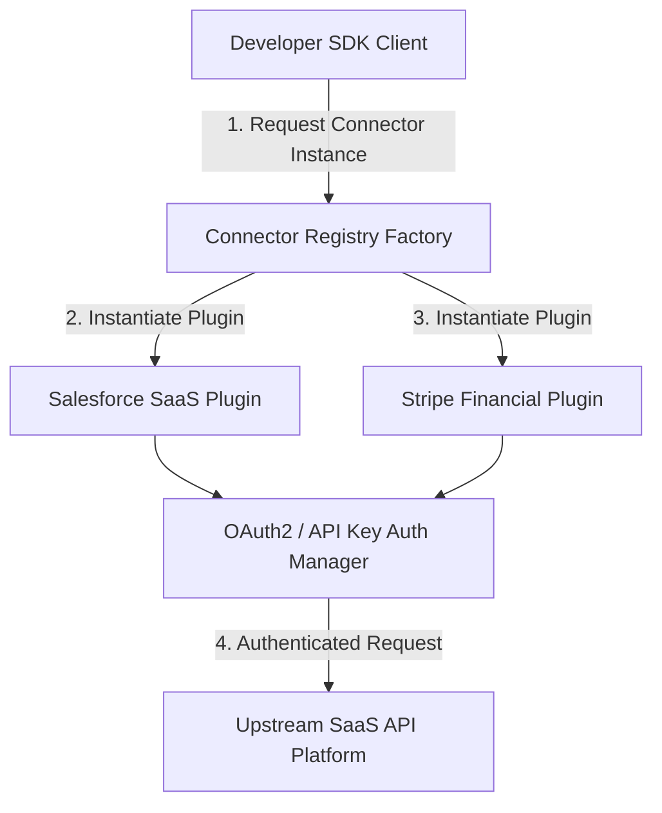

<div align="center">


# Connector Factory

### Dynamic SaaS Plugin Extensibility Framework & Python SDK

[](https://python.org)
[](https://devopstrio.co.uk)

</div>

---

## 🚀 Quickstart

Install the package and instantiate SaaS connectors dynamically using the unified client SDK:

```python
from sdk.client import ConnectorFactoryClient

# Initialize SDK Client
client = ConnectorFactoryClient()

# List registered plugins
print("Available plugins:", client.available_connectors())

# Instantiate Salesforce Plugin
sf = client.get_connector("salesforce", {"api_key": "secret-key-123"})
if sf.authenticate():
    records = sf.fetch_records("Opportunity")
    print("Salesforce Records:", records)
```

---

## 🏛️ Architecture Overview

The **Connector Factory** decoupling architecture allows developers to build plug-and-play connectors for enterprise SaaS systems without altering core SDK logic.




---

## 🧪 Testing Suite

Run the automated test suite locally:

```bash
python -m pytest -v tests/
```

<div align="center">

<sub>&copy; 2026 Devopstrio &mdash; Engineering Uninterrupted Global Workforce Productivity.</sub>

</div>
