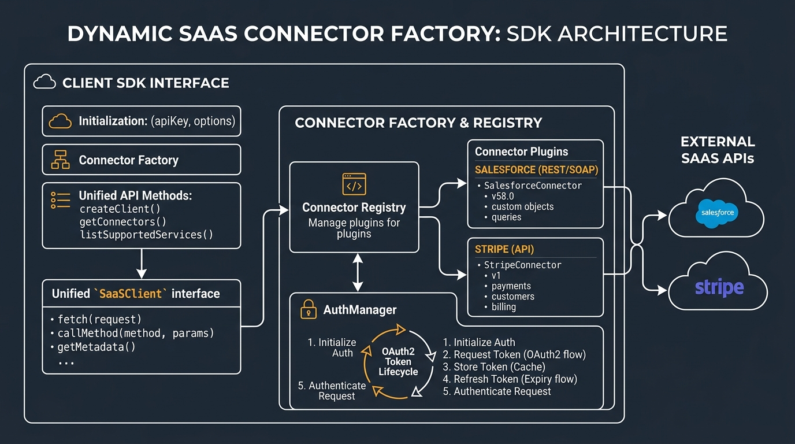
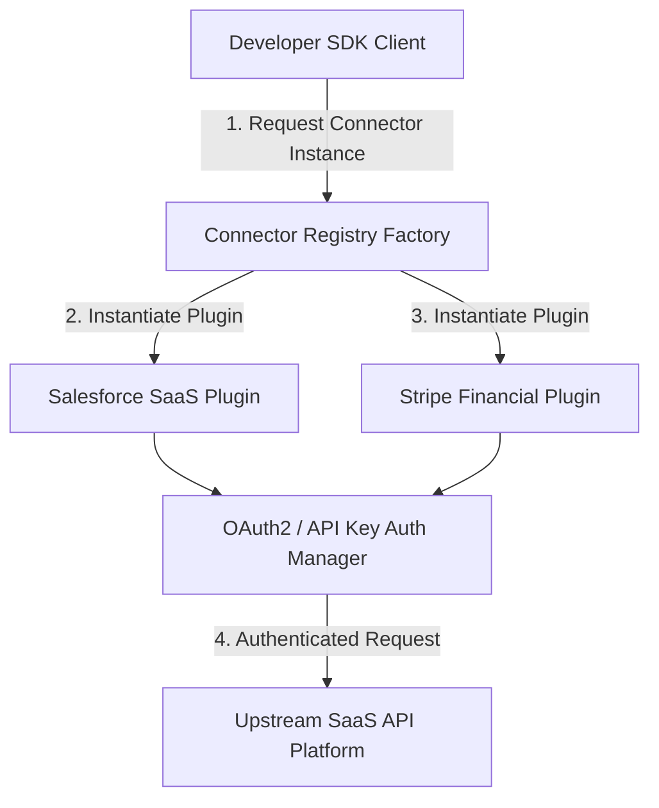

# Connector Factory SDK Architecture

The **Connector Factory Python SDK** provides a plugin extensibility framework, dynamic connector registry, OAuth2 token lifecycle manager, and unified client interface across enterprise SaaS platforms.

## Component Sequence Diagram

## Core Modules

1. **Connector Registry (`factory/connector_registry.py`)**
   - Dynamic plugin factory that maintains a registry of plugin classes and instantiates them on demand.

2. **Base Connector Interface (`factory/base_connector.py`)**
   - Abstract base contract establishing mandatory authentication and CRUD methods (`authenticate`, `fetch_records`, `write_record`).

3. **Authentication Manager (`factory/auth_manager.py`)**
   - Handles client credentials, token generation, and automatic expiration cycles.
